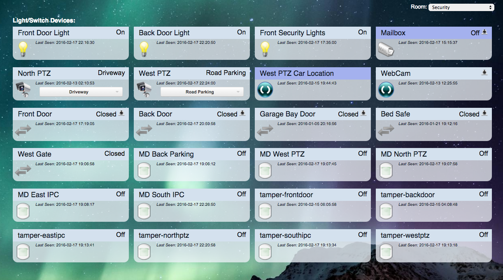

# Domoticz IP Camera Controller

This is a NodeJS service interfaces with IP Cameras and Domoticz, right now it only supports only Dahua cameras.

Goal: Turn your Security Cameras into Domoticz Motion Detectors, also expose any of the Cam's local Alarm IO to Domoticz.

It connects with Domoticz via the MQTT JSON API, and your Dahua IPC via HTTP API

### Features:
* Instant binary input from:
 * Video Motion Detector
 * Alarm Inputs (Dry Contacts)
 * Video Blank / Video Loss
* Selector Switches for PTZ Presets
* Switch between Day/Night Mode
* Switch External Output

### Software:
* IPC Controller - ME!
* Domoticz - http://www.domoticz.com
* Debian Jessie w/NodeJS from NodeSource repository
* Mosquitto MQTT Broker

### Web Screenshot:
Domoticz Devices:

### TO DO
* PTZ Selector Switch
* External Output
* Day/Night Switch

#### Support:
> No support provided or warranty impied, this project is avilable for educational use and my own personal tracking.
